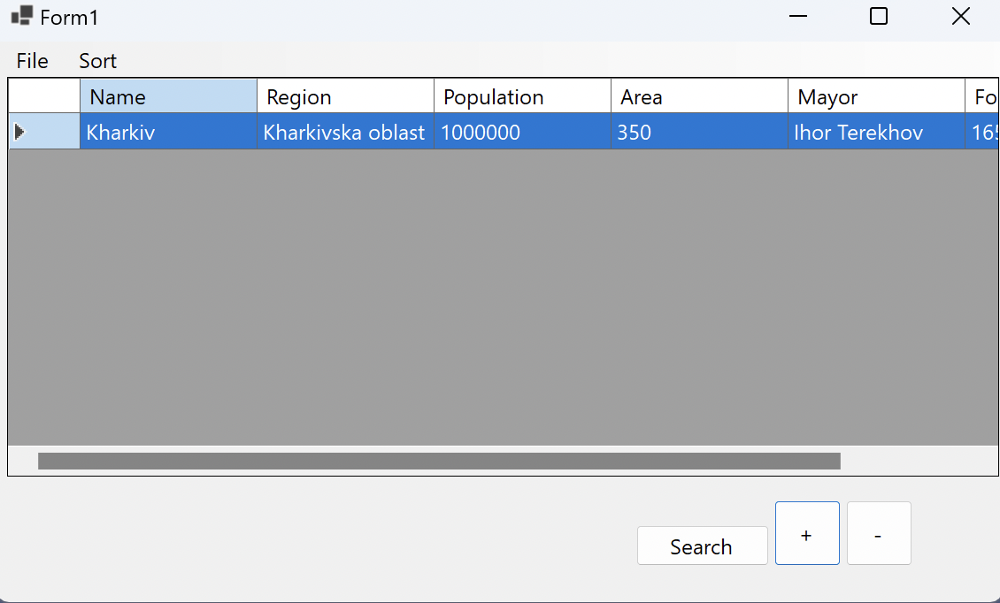

# Settlement Manager (Windows Forms Application)

A .NET desktop application built with Windows Forms for creating, viewing, updating, and deleting settlement records. This project was developed as part of a university course to apply and demonstrate practical skills in GUI development, application architecture, and data management.

The application features a clean, intuitive interface for managing a list of settlements, with functionality for persistence, sorting, and multi-criteria searching.

 
*(A screenshot of the main application window)*

---

## Key Features

- **Full CRUD Functionality:** Create, Read, Update, and Delete settlement records directly through the data grid.
- **Data Persistence:** Save the entire list of settlements to a file and load it back into the application.
- **Multi-Criteria Search:** A flexible search feature allowing users to filter settlements by any combination of fields (name, region, population, etc.) using LINQ.
- **Data Sorting:** Easily sort the data grid by settlement name or population.
- **Modular Architecture:** The core business logic is encapsulated in a separate `SettlementLibrary` class library, separating it from the UI layer and making the code more organized and maintainable.

## Technologies Used

- **C#**
- **.NET (v8.0)**
- **Windows Forms (WinForms)** for the graphical user interface.
- **LINQ** for complex data queries and manipulation.

---

## How to Run

1.  **Clone the repository:**
    ```bash
    git clone https://github.com/AntonHritsai/SettlementManager.git
    ```
2.  **Open in Visual Studio:**
    Navigate to the cloned folder and open the `SettlementManager.sln` file in a recent version of Visual Studio.
3.  **Build and Run:**
    Press `F5` or the "Start" button to build and run the application.
